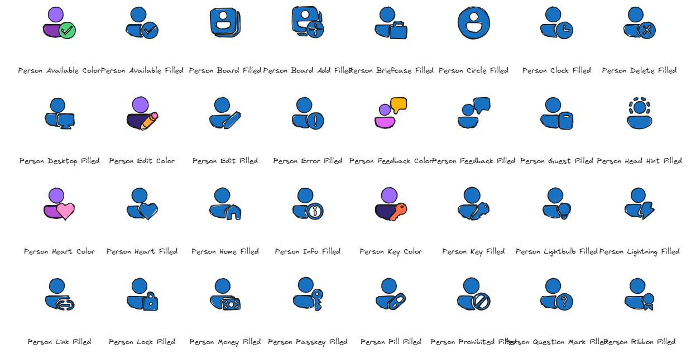

# Fluent UI Icons & Emojis to Excalidraw

This project automates converting the [Fluent UI](https://fluent2.microsoft.design/) icons and [Fluent Emojis](https://github.com/microsoft/fluentui-emoji)—designed and owned by Microsoft—into Excalidraw scenes that look hand drawn. It downloads the source SVGs directly from the upstream repositories, converts each icon/emoji into Excalidraw primitives (lines, rectangles, ellipses, text) using a sketchy style, and can bundle the results into grouped Excalidraw boards for easier browsing.

> **Note:** Every script, configuration, and generated artifact in this repository was authored end-to-end by GitHub Copilot. No manual code lines were written by hand.



## Downloading released artifacts

1. Open the repository's [Releases](https://github.com/wictorwilen/fluentui-icons-to-excalidraw/releases) page.
2. Locate the latest release (or the specific tag you need) and expand the **Assets** section.
3. Download the desired `.zip` bundle, such as `excalidraw_scenes.zip` or grouped board archives, and extract it locally.
4. Import the `.excalidraw` files into Excalidraw using *Menu → Open*.

## Features

### Icons
- Fetches the Fluent UI icon set without cloning the upstream repo.
- Converts SVG geometry into Excalidraw primitives (lines, rectangles, ellipses) with simplified polylines for a hand-drawn look.
- Applies consistent styling: stroke width 2, stroke color `#1e1e1e`, filled backgrounds `#1971c2`, roughness 1, roundness type 3, and 4x scaling.
- Detects circular and square path loops to use native Excalidraw ellipses and rectangles.
- Outputs `.excalidraw` files per icon and optionally combines them into grouped boards using several strategies.

### Emojis
- Fetches Fluent UI emojis in "Flat" style (optimized for Excalidraw compatibility) without cloning the repo.
- Uses consistent hand-drawn styling that matches the icon aesthetic.
- Supports skin tone variations for applicable emojis.
- Automatically categorizes emojis into themed libraries (People & Body, Smileys & Emotion, etc.).
- Creates both individual emoji files and combined emoji libraries.

## Prerequisites

- Python 3.9 or newer
- Internet access to pull SVG assets from GitHub
- Optional: `GITHUB_TOKEN` environment variable to raise GitHub API rate limits while downloading

Create and activate a virtual environment if desired:

```bash
python3 -m venv .venv
source .venv/bin/activate
pip install --upgrade pip
```

## Repository Layout

```
artifacts/                    # Generated Excalidraw outputs (ignored by git)
  excalidraw/                 # Individual icon Excalidraw files
  excalidraw_emojis/          # Individual emoji Excalidraw files
  excalidraw_categories/      # Grouped icon boards by category
  excalidraw_emoji_categories/ # Grouped emoji boards by category
  emoji_library.excalidraw    # Combined emoji library
scripts/
  fetch_icons.py        # Downloads Fluent UI icon metadata and SVG assets
  fetch_emojis.py       # Downloads Fluent UI emoji metadata and SVG assets
  path_parser.py        # Parses and simplifies SVG path data
  svg_to_excalidraw.py  # Converts SVGs into Excalidraw scenes
  emoji_to_excalidraw.py # Converts emoji SVGs into Excalidraw scenes
  combine_excalidraw.py # Bundles per-icon/emoji scenes into grouped boards
config/                 # Category keyword configuration for grouped boards
metadata/               # Generated metadata for icons and emojis
vendor/                 # Cached SVG assets
  icons/                # Fluent UI icons
  emojis/               # Fluent UI emojis
```

## 1. Download the Fluent UI SVG assets
Run the fetch script to download the required icons into `vendor/icons/assets`. Set `GITHUB_TOKEN` if you have one to raise rate limits.

```bash
python3 scripts/fetch_icons.py \
  --output metadata/icons.json \
  --download-dir vendor/icons \
  --force
```

The script writes metadata to `metadata/icons.json` and populates the SVG directory mirroring the upstream structure.

## 2. Convert SVG icons to individual Excalidraw files

Once the SVG assets exist locally, convert them into Excalidraw JSON scenes:

```bash
python3 scripts/svg_to_excalidraw.py \
  --input-dir vendor/icons/assets \
  --output-dir artifacts/excalidraw
```

This generates `.excalidraw` files with the same relative structure as the source icons. Filled icons receive a blue fill (`#1971c2`), all strokes use `#1e1e1e`, stroke width is 2, roughness is 1, and shapes are scaled 4x for easier editing.

Each file is a valid Excalidraw scene that can be opened directly in the Excalidraw editor.

## 3. Combine icons into larger Excalidraw boards (optional)

The combine script lets you assemble the per-icon scenes into grouped boards to reduce file size and improve navigation. By default it merges everything into a single file, but you can group by top-level directory, leading letter, curated categories, first-word buckets, or fixed-size batches.

Generate a single board with all icons:

```bash
python3 scripts/combine_excalidraw.py \
  --input-dir artifacts/excalidraw \
  --output artifacts/all_icons.excalidraw
```

Add `--exclude-regular` if you want to omit the `_regular` variants while keeping filled and color icons in the combined board.

Group files into curated categories (Navigation & Maps, Typography & Documents, and so on):

```bash
python3 scripts/combine_excalidraw.py \
  --input-dir artifacts/excalidraw \
  --output artifacts/excalidraw_categories \
  --group-by category \
  --columns 8 \
  --cell-width 220 \
  --cell-height 240 \
  --padding 24 \
  --label-gap 12 \
  --exclude-regular
```

Grouping writes one `.excalidraw` file per bucket into the target directory. The numeric layout options let you tweak spacing if some categories become crowded. Use `--group-by first-word` or `--group-by directory` when you need the older strategies.

Category buckets include typography, communication, people, navigation, scheduling, data, organization, media, devices, security, commerce, travel, places, nature, health, utilities, and general symbols, with a fallback `Other` set for unmatched icons. Adjust the mapping by editing `config/icon_categories.json` or supply a custom file via `--categories-file` when running the combine script.

### Export as Excalidraw libraries

Use the `--library` flag to emit reusable `.excalidrawlib` bundles instead of full scenes. Each icon is normalized to start at the origin and grouped so it appears as a single library item once imported into Excalidraw.

Create a single library file that contains every icon (regular variants excluded in this example):

```bash
python3 scripts/combine_excalidraw.py \
  --input-dir artifacts/excalidraw \
  --output artifacts/excalidraw_library/icons.excalidrawlib \
  --library \
  --exclude-regular
```

Generate one library file per curated category:

```bash
python3 scripts/combine_excalidraw.py \
  --input-dir artifacts/excalidraw \
  --output artifacts/excalidraw_library_categories \
  --group-by category \
  --library \
  --exclude-regular
```

Import the resulting `.excalidrawlib` files inside the Excalidraw editor via *Library → Open → Load*. Each icon appears as an individual drag-and-drop item that you can pin to your personal collection.

### Supported grouping strategies

- `none` (default): everything merged into the provided `--output` path.
- `directory`: group by the first directory under the input folder.
- `letter`: group by the first letter of the icon's label.
- `first-word`: group by the first word in the icon label (for example `Mail`, `Accessibility`).
- `category`: heuristic buckets such as Typography & Documents, Communication & Collaboration, Navigation & Maps, and more.
- `batch`: fixed-size batches using `--batch-size`.

When `--group-by` is not `none`, the value provided to `--output` should be a directory path where grouped files are written.

## Emoji Workflows

The project also includes comprehensive support for Fluent UI Emojis, following the same 3-step pattern as icons.

### 1. Download the Fluent UI Emoji SVG assets

Run the fetch script to download the required emojis into `vendor/emojis/assets`:

```bash
python3 scripts/fetch_emojis.py \
  --output metadata/emojis.json \
  --download-dir vendor/emojis \
  --force
```

Add `--limit 50` for testing with a smaller set, or omit to download all available emojis (~2000+).

### 2. Convert emoji SVGs to individual Excalidraw files

Once the emoji SVG assets exist locally, convert them into Excalidraw JSON scenes:

```bash
python3 scripts/emoji_to_excalidraw.py \
  --input-dir vendor/emojis/assets \
  --output-dir artifacts/excalidraw_emojis
```

The emoji converter automatically maps SVG colors to the closest Excalidraw palette colors, ensuring that the flat emoji style's vibrant colors are preserved in the converted files.

### 3. Combine emojis into larger Excalidraw boards (optional)

Generate a single board with all emojis:

```bash
python3 scripts/combine_excalidraw.py \
  --input-dir artifacts/excalidraw_emojis \
  --output artifacts/emoji_library.excalidraw \
  --group-by none \
  --columns 6 \
  --cell-width 180 \
  --cell-height 160 \
  --padding 30 \
  --label-gap 25
```

Group emojis into curated categories:

```bash
python3 scripts/combine_excalidraw.py \
  --input-dir artifacts/excalidraw_emojis \
  --output artifacts/excalidraw_emoji_categories \
  --group-by category \
  --columns 5 \
  --cell-width 200 \
  --cell-height 180 \
  --padding 35 \
  --label-gap 25
```

### Emoji style and colors

The system uses Fluent UI Emojis in the "Flat" style, which provides clean, simple designs that work well with Excalidraw's hand-drawn aesthetic. Other emoji styles (Color, 3D, High Contrast) contain gradients and complex styling that don't translate well to Excalidraw's vector format.

The converter includes intelligent color mapping that analyzes the original SVG colors and maps them to the closest colors in Excalidraw's standard palette. This ensures that emojis retain their visual appeal and distinctiveness while remaining compatible with Excalidraw's drawing tools.

### Emoji categories

Emojis are automatically categorized into themed groups:

- **Emojis**: All emoji-specific items (faces, hands, etc.)
- **People & Body**: Human figures and body parts
- **Animals & Nature**: Animals, plants, weather
- **Food & Drink**: Food items and beverages
- **Travel & Places**: Vehicles, buildings, geography
- **Activities**: Sports, games, celebrations
- **Objects**: Tools, electronics, everyday items
- **Symbols**: Signs, arrows, geometric shapes
- **Flags**: Country and regional flags

## Regeneration workflow

Whenever you tweak the conversion logic:

### For icons:
1. Clear prior outputs if needed: `rm -rf artifacts/excalidraw artifacts/excalidraw_categories`.
2. Re-run `svg_to_excalidraw.py` to rebuild per-icon files.
3. Re-run `combine_excalidraw.py` with your preferred grouping.

### For emojis:
1. Clear prior outputs if needed: `rm -rf artifacts/excalidraw_emojis artifacts/excalidraw_emoji_categories`.
2. Re-run `emoji_to_excalidraw.py` to rebuild per-emoji files.
3. Re-run `combine_excalidraw.py` with your preferred grouping for emoji libraries.
4. Optionally combine with icon libraries for comprehensive sets.

## Automated releases

A scheduled GitHub Actions workflow (`.github/workflows/release.yml`) rebuilds the full icon cache, converts every SVG into Excalidraw scenes, generates category-based grouped boards, and publishes the outputs as a release. Trigger it manually from the Actions tab or let the weekly schedule refresh the published archives. Adjust the categories by editing `config/icon_categories.json` before running the workflow if you need different buckets.

## Opening the results in Excalidraw

1. Visit [https://excalidraw.com](https://excalidraw.com) (or a self-hosted instance).
2. Use *Menu → Open* and select any generated `.excalidraw` file.
3. The scene loads with hand-drawn geometry that you can edit, recolor, or copy into other designs.

## License notes

This repository only contains generated artifacts and helper scripts. The underlying Fluent UI icon designs belong to Microsoft and are subject to their original licensing. Review the [Fluent UI System Icons license](https://github.com/microsoft/fluentui-system-icons) before redistributing any generated assets.

All code and documentation in this project were generated by GitHub Copilot without manual editing.

The code in this repository is distributed under the [MIT License](LICENSE). Fluent UI and the Fluent UI icon set are trademarks of Microsoft Corporation; their assets remain licensed under the terms of the [Fluent UI System Icons repository](https://github.com/microsoft/fluentui-system-icons).
